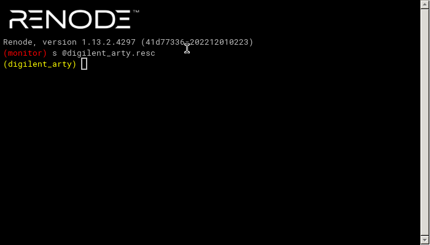
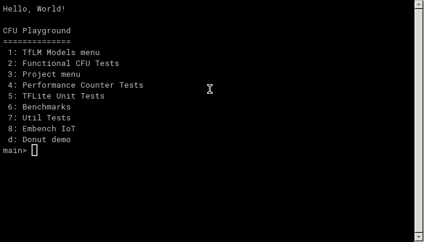

# CFU Playground tasks

This task will demonstrate open source co-development of hardware and software for ML purposes in a simulated environment.
The steps will be based on [Step-by-step Guide to CFU Playground](https://cfu-playground.readthedocs.io/en/latest/step-by-step.html).

## Preparing the development environment

Firstly, go to `cfu-playground directory`, clone [CFU Playground](https://github.com/google/CFU-Playground) and configure it using:

```bash
cd cfu-playground/

./clone-cfu-playground.sh
```

`NOTE`: The cloning step is recommended outside the Docker environment.

This script will clone the CFU Playground, set the commit to the last tested release and apply changes to allow external projects to be built within CFU Playground workflow.

Secondly, prepare the environment for development.

`NOTE`: To speed up things, you can use the course's Docker image:

```bash
docker pull ghcr.io/antmicro/dl-in-iot-course:latest
```

Since for this demo the access to display is recommended, you can start the Docker container with:

```bash
xhost +local:
docker run -it --rm \
    -v /tmp/.X11-unix/:/tmp/.X11-unix/ \
    -e DISPLAY=$DISPLAY \
    -e XDG_RUNTIME_DIR=$XDG_RUNTIME_DIR \
    -v $(pwd):$(pwd) \
    -w $(pwd) \
    --net=host \
    ghcr.io/antmicro/dl-in-iot-course:latest /bin/bash
```

The `xhost +local:` will allow Docker container to use display, while `DISPLAY`, `XDG_RUNTIME_DIR` and `/tmp/.X11-unix` from host allow to seamlessly run graphical applications from container.

Regardless of using container or not, go to cloned repository and run setup script:

```bash
cd CFU-Playground/
git config --global --add safe.directory $(pwd)
./scripts/setup
cd -
```

`NOTE`: The `git config` command is required in Docker container to disable dubious ownership error.
`NOTE`: The log `Info: vivado not found in path.` can be ignored - we will not use Vivado in this demo.

Thirdly, create a project from the template in the `cfu-playground/cfu_proj` directory:

```bash
cp -r CFU-Playground/proj/proj_template cfu_proj
```

In the copied `cfu_proj` directory, modify the [line](https://github.com/google/CFU-Playground/blob/e9f32c9484ae0c21fbbd822a013a469090ebc6a4/proj/proj_template/Makefile#L46):

```bash
include ../proj.mk
```

with:

```bash
include ${CFU_ROOT}/proj/proj.mk
```

(it should be the last line of the `Makefile`)

* `[2pt]` Commit the contents of the `cfu_proj` directory.

## Building the project

Since our project is out of the CFU Playground tree, we firstly need to set up some environment variables:

```
export CFU_ROOT=$(pwd)/CFU-Playground
export PROJ_DIR=$(pwd)/cfu_proj
```

`NOTE`: Those variables need to be set every time a fresh environment (fresh Docker container or shell) is created.

Now, we do not have a hardware to test the design on, so we will simulate it using [Renode](https://renode.io/).
For more details on the framework check out [Renode docs](https://renode.readthedocs.io/en/latest/).

You can build and run the simulation with:

```bash
cd cfu_proj
make renode
```

From now on, let's work in the created `cfu_proj` directory.

Please run:
```bash
make renode | tee first-run.txt
```

To build an entire project and run the simulation in Renode.
It will also store the logs for building and execution in the `first-run.txt` file.

The simulation will run two windows.

The first one is the main Renode console:



And the second one is the serial console (UART) of the simulated board, with which we control the board:



Apart from those windows, there will also be logs in the terminal running the simulation.
From this terminal you will copy the outputs of executed commands.

In the UART console, run person detection demo implemented in TFLite Micro running no the simulated board:

* In the `Hello, World!/CFU Playground` main menu press `1` (`TfLM Models menu`)
* In the `TfLM Models` menu, click `1` (`Person Detection int8 model`)
* In there, you can select 1/2/3 to test out various inputs feeded to the model
* In the end, click `g` to `Run golden tests`

IF Golden tests finish with:

```
OK  Golden tests passed
```

It means that everything is implemented correctly.

To quit the simulation, run `quit` command in the main Renode console.

`NOTE`: In case the GUI applications do not appear, please check [Running simulation without access to GUI application](#running-simulation-without-access-to-gui-application).

* `[5pt]` Please create a commit adding `first-run.txt` file to the repository.

`NOTE`: Originally, you would run `make prog` and `make load` to build the project dependencies, synthesize the design, load the design to FPGA and run the application on actual hardware.
For more details, check original [Step-by-step guide](https://cfu-playground.readthedocs.io/en/latest/step-by-step.html).

## Profiling the CONV2D operation

Now, let's see how many instructions are executed per CONV2D operations in our model.

First, let's copy the implementation of the convolution to our project directory:

```bash
mkdir -p src/tensorflow/lite/kernels/internal/reference/integer_ops/
cp ../CFU-Playground/third_party/tflite-micro/tensorflow/lite/kernels/internal/reference/integer_ops/conv.h src/tensorflow/lite/kernels/internal/reference/integer_ops/conv.h
```

In the copied [`conv.h`](https://github.com/google/CFU-Playground/blob/main/common/src/perf.h) file, add:

```cpp
#include "perf.h"
```

After:
```cpp
#include <algorithm>
```

This file adds some functions and global variables for profiling number of CPU cycles used to compute functions.

After this, locate the innermost loop of the convolution implementation - it should look something like this:

```cpp
  for (int in_channel = 0; in_channel < filter_input_depth;
       ++in_channel) {
    int32_t input_val =
        input_data[Offset(input_shape, batch, in_y, in_x,
                          in_channel + group * filter_input_depth)];
    int32_t filter_val = filter_data[Offset(
        filter_shape, out_channel, filter_y, filter_x, in_channel)];
    // ...
    acc += filter_val * (input_val + input_offset);
  }
```

Wrap this innermost loop with:

```cpp
  uint32_t beginc = perf_get_mcycle();
  for (int in_channel = 0; in_channel < filter_input_depth;
       ++in_channel) {
    int32_t input_val =
        input_data[Offset(input_shape, batch, in_y, in_x,
                          in_channel + group * filter_input_depth)];
    int32_t filter_val = filter_data[Offset(
        filter_shape, out_channel, filter_y, filter_x, in_channel)];
    // ...
    acc += filter_val * (input_val + input_offset);
  }
  cycle_counter += perf_get_mcycle() - beginc;
```

Run:

```bash
make renode | tee initial-profiling.txt
```

and run golden tests for person detection to collect data.
Over 60% of cycles are part of this innermost loop, which gives some opportunity for optimizations.

* `[5pt]` Commit changes in the project and `initial-profiling.txt` log

## Optimizing the software

Usually on edge platforms we have a very specific use case running a single model.
This gives opportunity for further, model-specific optimizations, even in the library.

Let's check parameters used for CONV2D in a given model.

In the previously edited `conv.h` file include the [`playground_util/print_params.h`](https://github.com/google/CFU-Playground/blob/main/common/src/playground_util/print_params.h) and add:

```cpp
print_conv_params(params, input_shape, filter_shape, output_shape);
```

line to the beginning of `ConvPerChannel` function.

Run:


```bash
make renode | tee conv2d-analysis.txt
```

* `[3pt]` Include changes and log file in the commit

As it can be seen, we have some constant parameters:


|Const. Parameter        |Value
|------------------------|-----
|`stride_width          `|1
|`stride_height         `|1
|`dilation_width_factor `|1
|`dilation_height_factor`|1
|`filter_height         `|1
|`filter_width          `|1
|`pad_width             `|0
|`pad_height            `|0
|`input_offset          `|128

Let's replace all of computed `const int` parameters listed above with `constexpr int ...` replacements with values used from the table.

This will assign variables at compile time to save number of cycles spent on assignments.

Collect logs as previously and save them under `forced-constant-folding.txt` - run golden tests:

```bash
make renode | tee forced-constant-folding.txt
```

* `[8pt]` Commit changes and `forced-constant-folding.txt` in the repository

This change should quite interestingly reduce the number of cycles used.

Next thing to do is partial loop unrolling - since `input_depth` is always a multiplier of 4, we can do something like this:

```cpp
  uint32_t bcycles = perf_get_mcycle();
  for (int in_channel = 0; in_channel < input_depth; in_channel += 4) {
    int32_t input_val = input_data[Offset(input_shape, batch, in_y,
                                            in_x, in_channel)];
    int32_t filter_val = filter_data[Offset(
        filter_shape, out_channel, filter_y, filter_x, in_channel)];
    acc += filter_val * (input_val + input_offset);

    input_val = input_data[Offset(input_shape, batch, in_y,
                                            in_x, in_channel + 1)];
    filter_val = filter_data[Offset(
        filter_shape, out_channel, filter_y, filter_x, in_channel + 1)];
    acc += filter_val * (input_val + input_offset);

    input_val = input_data[Offset(input_shape, batch, in_y,
                                            in_x, in_channel + 2)];
    filter_val = filter_data[Offset(
        filter_shape, out_channel, filter_y, filter_x, in_channel + 2)];
    acc += filter_val * (input_val + input_offset);

    input_val = input_data[Offset(input_shape, batch, in_y,
                                            in_x, in_channel + 3)];
    filter_val = filter_data[Offset(
        filter_shape, out_channel, filter_y, filter_x, in_channel + 3)];
    acc += filter_val * (input_val + input_offset);
  }
  cycle_counter += perf_get_mcycle() - bcycles;
```

You also need to remove/comment out `group`, `filters_per_group` and `groups` variables.

Run the golden tests and store logs in `loop-unrolling.txt`:

```bash
make renode | tee loop-unrolling.txt
```

* `[5pt]` Include changes and log in the commit message.

## Delving into hardware

The RISC-V CPU implementation is [VexRiscv](https://github.com/SpinalHDL/VexRiscv), which is a 32-bit implementation.
It means it operates on 32-bit registers.

We currently operate on 8-bit values stored contiguously in memory.
Using 32-bit registers for computing 8-bit values one by one is a huge waste of computational resources.
Having 32-bit registers at our disposal we could operate on 4 values at once.

While VexRiscv does not have multiply-and-accumulate operation that would operate on multiple data, it has Custom Function Units (CFUs), allowing the user to easily extend the capabilities of the CPU with their own design for new operations.

The development of a new CFU can be done simply in Python using Amaranth project.

The base for new instruction is implemented in the [`amaranth_cfu` module from CFU Playground project](https://github.com/google/CFU-Playground/blob/main/python/amaranth_cfu/cfu.py).

The base implementation looks as follows:

```python
class InstructionBase(SimpleElaboratable):
    """Custom Instruction.
    Attributes
    ----------
    start: Signal input
        When to start executing this instruction. Set only for one cycle.
    in0: Signal(32) input
        The first operand. Only available when `start` is signalled.
    in1: Signal(32) input
        The second operand. Only available when `start` is signalled.
    funct7: Signal(7) input
        The funct(7) value from the instruction.
    done: Signal() output
        Single cycle signal to indicate that processing has finished.
    output: Signal(32) output
        The result. Must be valid when `done` is signalled.
    in0s: Signal(signed(32)) output
        in0 as a signed value. Use in0s rather than in0 if the input is signed.
    in1s: Signal(32) output
        in1 as a signed value. Use in1s rather than in1 if the input is signed.
    """

    def __init__(self):
        self.in0 = Signal(32)
        self.in1 = Signal(32)
        self.funct7 = Signal(7)
        self.output = Signal(32)
        self.start = Signal()
        self.done = Signal()
        self.in0s = Signal(signed(32))
        self.in1s = Signal(signed(32))

    def signal_done(self, m):
        m.d.comb += self.done.eq(1)

    def elaborate(self, platform):
        m = super().elaborate(platform)
        m.d.comb += [
            self.in0s.eq(self.in0),
            self.in1s.eq(self.in1),
        ]
        return m
```

* `start` and `done` signals indicate starting the computation (input data is ready to process) and finishing the computation (output is ready to be fetched).
* `in0`, `in0s`, `in1`, `in1s` are operands of the operation, in unsigned or signed representation.
* `output` is the output of the operation.
* `funct7` is a 7-bit representation of instruction settings.

Let's create a CFU that will do a SIMD-like multiply-and-add operation on 8-bit values.

In the `cfu.py` file in our `cfu_proj` project, let's add the following implementation of the SIMD instruction:

```python
from amaranth_cfu import all_words


# Custom instruction inherits from the InstructionBase class.
class SimdMac(InstructionBase):
    def __init__(self, input_offset=128) -> None:
        super().__init__()

        self.input_offset = C(input_offset, signed(9))

    # `elab` method implements the logic of the instruction.
    def elab(self, m: Module) -> None:
        words = lambda s: all_words(s, 8)

        # SIMD multiply step:
        self.prods = [Signal(signed(16)) for _ in range(4)]
        for prod, w0, w1 in zip(self.prods, words(self.in0), words(self.in1)):
            m.d.comb += prod.eq(
                (w0.as_signed() + self.input_offset) * w1.as_signed())

        m.d.sync += self.done.eq(0)
        # self.start signal high for one cycle when instruction started.
        with m.If(self.start):
            with m.If(self.funct7):
                m.d.sync += self.output.eq(0)
            with m.Else():
                # Accumulate step:
                m.d.sync += self.output.eq(self.output + sum(self.prods))
            # self.done signal indicates instruction is completed.
            m.d.sync += self.done.eq(1)


# Tests for the instruction inherit from InstructionTestBase class.
class SimdMacTest(InstructionTestBase):
    def create_dut(self):
        return SimdMac()

    def test(self):
        # self.verify method steps through expected inputs and outputs.
        self.verify([
            (1, 0, 0, 0),  # reset
            (0, pack_vals(-128, 0, 0, 1), pack_vals(111, 0, 0, 1), 129 * 1),
            (0, pack_vals(0, -128, 1, 0), pack_vals(0, 52, 1, 0), 129 * 2),
            (0, pack_vals(0, 1, 0, 0), pack_vals(0, 1, 0, 0), 129 * 3),
            (0, pack_vals(1, 0, 0, 0), pack_vals(1, 0, 0, 0), 129 * 4),
            (0, pack_vals(0, 0, 0, 0), pack_vals(0, 0, 0, 0), 129 * 4),
            (0, pack_vals(0, 0, 0, 0), pack_vals(-5, 0, 0, 0), 0xffffff84),
            (1, 0, 0, 0),  # reset
            (0, pack_vals(-12, -128, -88, -128), pack_vals(-1, -7, -16,
                                                           15), 0xfffffd0c),
            (1, 0, 0, 0),  # reset
            (0, pack_vals(127, 127, 127, 127), pack_vals(127, 127, 127,
                                                         127), 129540),
            (1, 0, 0, 0),  # reset
            (0, pack_vals(127, 127, 127,
                          127), pack_vals(-128, -128, -128, -128), 0xfffe0200),
        ])
```

The `SimdMac` class implements the SIMD operation.
While delving into an FPGA world is a matter of an entire course, here are some words of explanation:

* In Amaranth representation of FPGA computations we have a [Module](https://amaranth-lang.org/docs/amaranth/latest/lang.html#modules) `m`
* Data is driven through [Signals](https://amaranth-lang.org/docs/amaranth/latest/lang.html#signals) (`Signal`) - those are multi-channel streams of data with specified number of driven bits, e.g. `Signal(16)` means 16-bit signal (like 16 wires).
* Each Signal can be assigned in a [combinatorial](https://amaranth-lang.org/docs/amaranth/latest/lang.html#combinatorial-evaluation) (`m.d.comb`) or [synchronous](https://amaranth-lang.org/docs/amaranth/latest/lang.html#synchronous-evaluation) (`m.d.sync`) [domain](https://amaranth-lang.org/docs/amaranth/latest/lang.html#control-domains) (`m.d`)
* Signals in the combinatorial domain change whenever any value used to compute them changes.
  They do not hold any state.
* Signals in the synchronous domain change whenever a specific transition (positive or negative edge) occurs ion the clock of the synchronous domain.
  Synchronous signals always hold state (since last clock tick).
* In `__init__`, the `input_offset` is created as a [constant signal](https://amaranth-lang.org/docs/amaranth/latest/lang.html#constants) using 9 bits (storing 128).
* `all_words(s, 8)` splits `s` signal into 8-bit words.
* `self.prods` holds 16-bit signals being the results of multiplying two 8-bit values in a combinatorial domain (we compute element-wise multiplication as soon as data arrives and for as long as data is present in the inputs).
* `m.d.sync += self.done.eq(0)` sets the `done` signal to 0 on clock
* If CPU requests computing SIMD operation, we proceed with updating the output synchronously
* If `self.funct7` is set to something else than 0 we reset the `output` signal
* Otherwise, we update `output` signal to its current value plus current values in `prods` signals.
* In the end, we set `done` signal to 1, indicating the end of computations.

`NOTE:` For more details check the links provided in the above explanation and the [Resources section](#resources)

The `SimdMacTest` class runs tests on the given CFU instruction.
In the `self.verify` list we have values for:

* `funct7`
* `in0`
* `in1`
* `output`

In the end, we need to register the operation in the existing `make_cfu` function.
For this, change its current implementation to:

```python
# Expose make_cfu function for cfu_gen.py
def make_cfu():
    # Associate cfu_op0 with SimdMac.
    return simple_cfu({0: SimdMac()})
```

* `[8pt]` Commit current changes of the `cfu.py` file.

## Using CFU in software

To use our CFU function (`cfu_op0`), we need to include `cfu.h` file in our `conv.h` file:

```cpp
#include "cfu.h"
```

This requires more extensive changes - we need to replace loop iterating over output channels with:

```cpp
for (int out_channel = 0; out_channel < output_depth; ++out_channel) {
  int32_t acc = cfu_op0(/* funct7= */ 1, 0, 0); // resets acc
  for (int filter_y = 0; filter_y < 1; ++filter_y) {
    const int in_y = in_y_origin + filter_y;
    for (int filter_x = 0; filter_x < 1; ++filter_x) {
      const int in_x = in_x_origin + filter_x;

      // Zero padding by omitting the areas outside the image.
      const bool is_point_inside_image =
          (in_x >= 0) && (in_x < input_width) && (in_y >= 0) &&
          (in_y < input_height);

      if (!is_point_inside_image) {
        continue;
      }
      uint32_t bcycles = perf_get_mcycle();
      for (int in_channel = 0; in_channel < input_depth; in_channel += 4) {
        uint32_t input_val = *((uint32_t *)(input_data + Offset(
            input_shape, batch, in_y, in_x, in_channel)));

        uint32_t filter_val = *((uint32_t *)(filter_data + Offset(
            filter_shape, out_channel, filter_y, filter_x, in_channel)));
        acc = cfu_op0(/* funct7= */ 0, /* in0= */ input_val, /* in1= */ filter_val);
      }
      cycle_counter += perf_get_mcycle() - bcycles;
    }
  }

  if (bias_data) {
    acc += bias_data[out_channel];
  }
  acc = MultiplyByQuantizedMultiplier(
      acc, output_multiplier[out_channel], output_shift[out_channel]);
  acc += output_offset;
  acc = std::max(acc, output_activation_min);
  acc = std::min(acc, output_activation_max);
  output_data[Offset(output_shape, batch, out_y, out_x, out_channel)] =
      static_cast<int8_t>(acc);
}
```

`NOTE:` You also need to remove/comment out the `dilation_width_factor`, `dilation_height_factor`, `filters_height`, `filters_width`, `filters_per_group` variables.

As can be observed, we need to reset accumulator and shift certain operations.
The unrolled loops are replaced with `cfu_op0` operations.

Run:

```bash
make renode | tee cfu-op.txt
```

And run golden tests on person detection model.

* `[10pt]` Commit the changes of `cfu_proj` and `cfu-op.txt` file.

## Summary

`[10pt]` Create a minimal `SUMMARY.md` file containing a table with:

* Total cycles
* Tracked cycles
* % of cycles spent on innermost loop (`tracked_cycles` / `total_cycles`)

For:

* Initial profiling
* Forced constant folding
* Loop unrolling
* CFU operations

To see how those software and hardware alterations improved overall execution of a simple model.

## Running simulation without access to GUI application

`NOTE`: Steps here are only necessary when no GUI is available in your environment (either you run solution from SSH, you run Docker container without display configured, e.g. in Windows or Mac OS).

In case the dedicated terminals can't be started for Renode, `make renode` will start Renode simulation and display the main Renode shell.
From this shell, you can control the simulation process.
Still, to run performance tests for the assignment, you also need to access PTY terminal for the simulated device, to request specific model and run golden tests.
For this, we need a simulated UART device attached to our Docker container, and a separate shell that will connect to this UART with `picocom`.

To do so, follow the steps:

* Open new bash session in the same Docker container (you can skip those steps if you don't use Docker container)

    * First of, run `docker ps` and determine which container runs your current session (the container with the course's image)
    * After determining the name of the container (`<container-name>`), run:
      ```bash
      docker exec -it <container-name> /bin/bash
      ```
    * Check if `picocom` is present in the container (e.g. if `which picocom` returns any path).
      If not, install it with `apt-get update && apt-get install picocom`.
* From this point, you should have two bash shells:
    * One with `make renode` running, with `digilent_arty` prompt
    * One ready to run `picocom` to communicate via UART with simulated PTY terminal
* In the `digilent_arty` terminal, run:
  ```
  emulation CreateUartPtyTerminal "uart" "/tmp/uart"
  connector Connect sysbus.uart uart
  ```
  The first command will create a PTY device in the host machine (Docker container) under `/tmp/uart`, aliased as `uart` within Renode simulation.
  The second command will attach UART from device's sysbus (`sysbus.uart`) to a given `uart` alias, mimicking connection of the simulated Digilent Arty device to the host device.
* In the end, in the second terminal, run:
  ```
  picocom -b 115200 /tmp/uart
  ```
  to start communication with the simulated device via UART (`-b 115200` means setting baud rate to 115200 bps).
* From this point, you can select model and golden tests in the device's prompt.

Regarding `emulation` and `connector` commands, if you built the entire project at least once, you can:

* Enter created `cfu_proj` directory
* Copy the generated Renode script:
  ```bash
  mkdir renode
  cp build/renode/digilent_arty.resc renode/digilent_arty.resc
  ```
* Add following lines to the end of the newly created `renode/digilent_arty.resc`:
  ```
  emulation CreateUartPtyTerminal "uart" "/tmp/uart"
  connector Connect sysbus.uart uart
  ```
* With such addition, with each consecutive build the Renode script in `build/renode/digilent_arty.resc` will be the same as in the newly created file, creating `/tmp/uart` on host (Docker container) by default.

`NOTE`: You will have to run `picocom` for every new session of tests, since the device will be detached, but the shell running `picocom` can be left without changes.

## Resources

* [CFU Playground repository](https://github.com/google/CFU-Playground)
* [CFU Playground page](https://google.github.io/CFU-Playground/)
* [CFU Playground docs](https://cfu-playground.readthedocs.io/en/latest/)
* [The Step-by-Step Guide to Building an ML Accelerator](https://cfu-playground.readthedocs.io/en/latest/step-by-step.html)
* [Amaranth repository](https://github.com/amaranth-lang/amaranth)
* [Amaranth docs](https://amaranth-lang.org/docs/amaranth/latest/)
* [Amaranth language guide](https://amaranth-lang.org/docs/amaranth/latest/lang.html)
* [Amaranth tutorial](https://github.com/robertbaruch/amaranth-tutorial)
* [Learning FPGA Design with nMigen](https://vivonomicon.com/2020/04/14/learning-fpga-design-with-nmigen/)
